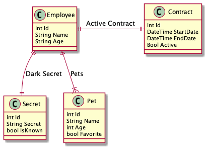

# Throw Away Conditional Associations

Exploring ideas for how to include associations within a RESTful design.

## The Problem

When designing a RESTful API we want to provide a clean API that provides everything that we deem a user will need. Typically providing the root information for a resource can be sufficient, however different implementations have different requirements depending on the view they are trying to provide.

Lets consider the following data model:



There are many design choices we can make regarding serving the data. For example, we could make endpoints with the purpose of finding that resourcing, be it by ID or via query.
However by doing so, views that require one or more of these resources need to perform multiple requests. This is often not a big problem, but inconvenient.

Example JSONs

```JSON
/* GET baseurl/Employee/1 */
{
  "Id": "1",
  "Name": "Bob",
  "Age" : "27",
  "PetName": "Fluffy"
}
```

```JSON
/* GET baseurl/Contract/Id */
{
  "StartDate": "10/01/2020",
  "EndDate" : "10/01/2021",
  "Active": "False"
}
```

The two resources are not aware of each other.

### Alternative

It could be appealing to simply add all nested relations without any consideration, like so:

```JSON
/* GET baseurl/Employee/Id */
{
  "Id": "1",
  "Name": "Bob",
  "Age" : "27",
  "PetName": "Fluffy",
  "ActiveContract": {
    "StartDate": "10/01/2020",
    "EndDate" : "10/01/2021",
    "Active": "False"
  }
}
```

And in some cases this could make sense, maybe the two resources are tightly coupled and should stick together. However this might not be the case with more complex objects which contain multiple associations, where you would really feel the impact including all those relationships.

## The Idea

Offer the API user the option to query which associations they would like to include.

Example: `baseurl/resource?include=assoication,anotherassoication`

Example using data model

```JSON
/* GET baseurl/Employee/1  NO Include parameter*/
{
  "Id": "1",
  "Name": "Bob",
  "Age" : "27",
  "PetName": "Fluffy",
  "ActiveContract": null,
  "Secret": null
}

/*GET baseurl/Employee/1?Include=ActiveContract  With Include parameter*/
{
  "Id": "1",
  "Name": "Bob",
  "Age" : "27",
  "PetName": "Fluffy",
  "ActiveContract": {
    "StartDate": "10/01/2020",
    "EndDate" : "10/01/2021",
    "Active": "False"
  },
  "Secret": null
}
```